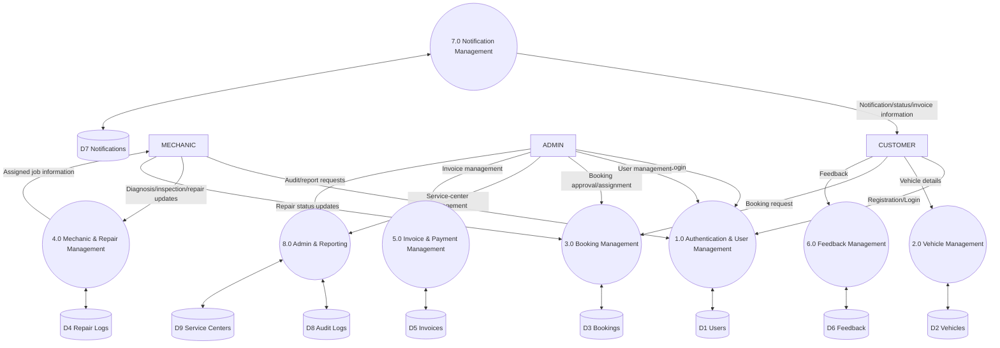

# FleetOps Pro — System Design Document

**Project Name**: FleetOps Pro — Smart Vehicle Service Management System  
**Academic Domain**: Enterprise Web Systems, Distributed Automotive Service Platforms  
**Architecture Pattern**: Decoupled Monorepo (Client-Server Architecture with WebSockets)  
**Technology Stack**: React 19, TypeScript, Vite, Node.js, Express.js, Firebase Firestore, Socket.IO, Tailwind CSS  

---

## 1. System Overview

FleetOps Pro is an integrated automotive service and garage operations management platform designed to automate and streamline vehicle lifecycle workflows, service appointment schedules, workshop technician allocation, and enterprise administrative governance.

The system establishes unified coordination across three primary organizational actors:
- **Customers**: Vehicle owners managing maintenance schedules, booking appointments, and monitoring live bay progress.
- **Mechanics**: Automotive technicians executing diagnostic inspections, recording labor notes, and updating repair phases.
- **Administrators**: Operations managers overseeing system performance, auditing platform transactions, managing staff rosters, and verifying service center facilities.

---

## 2. System Architecture & Diagrams

The system follows a layered software architecture comprising a responsive presentation tier (Single Page Application), an application programming interface layer (Express.js REST controllers and WebSocket gateways), a domain business logic tier, and a NoSQL document database (Firebase Firestore) supported by an atomic JSON persistence layer for rapid local evaluation.

### Tier Architecture

```
                      ┌─────────────────────────────────────────┐
                      │          React 19 Frontend SPA          │
                      │  (Dashboard, Live Track, RBAC Viewers)  │
                      └────────────────────┬────────────────────┘
                                           │
                                  HTTP / WebSockets
                                           │
                      ┌────────────────────▼────────────────────┐
                      │          Express.js API Server          │
                      │        (Middleware, Validators)        │
                      └──────────┬──────────────────┬───────────┘
                                 │                  │
                ┌────────────────┴─┐              ┌─┴────────────────┐
                │  Firebase Admin  │              │   JSON Atomic    │
                │ Firestore Engine │              │   Store Engine   │
                └──────────────────┘              └──────────────────┘
```

### Admin Control Center Architecture & User-Flow Diagram

```
Admin
 ↓
Admin Dashboard
 ├── User Management
 ├── Service Center Management
 ├── Global Search
 ├── System Health
 ├── Activity / Audit Logs
 ├── Booking Management
 ├── Analytics & Reports
 └── Billing
```

### Data Flow Diagram (DFD) - Level 1



### Process Breakdown

**1.0 Authentication & User Management**
- Connects to **D1 Users**.
- CUSTOMER and MECHANIC perform registration and login.
- ADMIN manages user credentials, roles, and profiles.

**2.0 Vehicle Management**
- Connects to **D2 Vehicles**.
- CUSTOMER provides and manages vehicle details.

**3.0 Booking Management**
- Connects to **D3 Bookings**.
- CUSTOMER initiates booking requests.
- ADMIN oversees booking approvals and mechanic assignments.
- MECHANIC provides repair status updates.

**4.0 Mechanic & Repair Management**
- Connects to **D4 Repair Logs**.
- MECHANIC receives assigned job information and submits diagnosis, inspection, and repair updates.

**5.0 Invoice & Payment Management**
- Connects to **D5 Invoices**.
- ADMIN manages invoice generation and simulated payments.

**6.0 Feedback Management**
- Connects to **D6 Feedback**.
- CUSTOMER submits post-service feedback and ratings.

**7.0 Notification Management**
- Connects to **D7 Notifications**.
- System dispatches notification, status, and invoice information to CUSTOMER.

**8.0 Admin & Reporting**
- Connects to **D8 Audit Logs** and **D9 Service Centers**.
- ADMIN handles service-center management and requests audit or system reports.

### Entity-Relationship (ER) Logical Data Model

```mermaid
erDiagram
    %% Logical Data Model (Firebase Firestore Collections)
    USERS ||--o{ VEHICLES : "1:N"
    USERS ||--o{ BOOKINGS : "1:N (customerId)"
    USERS ||--o{ BOOKINGS : "1:N (mechanicId)"
    VEHICLES ||--o{ BOOKINGS : "1:N"
    SERVICE_CENTERS ||--o{ BOOKINGS : "1:N"
    BOOKINGS ||--o{ REPAIR_LOGS : "1:N"
    BOOKINGS ||--|| INVOICES : "1:1"
    BOOKINGS ||--o| FEEDBACK : "1:0..1"
    USERS ||--o{ NOTIFICATIONS : "1:N"
    USERS ||--o{ AUDIT_LOGS : "1:N"
    USERS ||--o{ MARKETPLACE : "1:N (sellerId)"

    USERS {
        string id PK
    }
    VEHICLES {
        string id PK
        string ownerId Ref
    }
    BOOKINGS {
        string id PK
        string customerId Ref
        string mechanicId Ref
        string vehicleId Ref
        string serviceCenterId Ref
    }
    SERVICE_CENTERS {
        string id PK
    }
    REPAIR_LOGS {
        string id PK
        string bookingId Ref
    }
    INVOICES {
        string id PK
        string bookingId Ref
    }
    FEEDBACK {
        string id PK
        string bookingId Ref
    }
    NOTIFICATIONS {
        string id PK
        string userId Ref
    }
    AUDIT_LOGS {
        string id PK
        string userId Ref
    }
    MARKETPLACE {
        string id PK
        string sellerId Ref
    }
```

---

## 3. User Roles & Access Control

FleetOps Pro enforces Role-Based Access Control (RBAC) across all protected routes via JSON Web Token (JWT) verification and role-specific gateway middleware. Passwords are securely hashed using bcryptjs with 10 salt rounds. Plain-text passwords are never stored.

### 1. Customer
- Register and authenticate individual accounts.
- Register, update, and manage personal vehicles.
- Create service appointments and select target repair categories.
- Track real-time repair status from intake to pickup.
- Review issued service invoices and perform simulated checkout.
- Submit post-service customer ratings and reviews.

### 2. Mechanic
- Access assigned workshop repair orders in a dedicated queue.
- Transition vehicle service stages through defined workflow checkpoints.
- Record detailed technical repair logs, parts replacements, and labor hours.
- Perform software-based vehicle inspections and view OBD diagnostic fault codes.

### 3. Administrator
The Administrator maintains operational and organizational authority across the system, with permissions to:
- **Manage users**: Provision, configure, and inspect customer, mechanic, and staff accounts.
- **Suspend/activate users**: Dynamically toggle account operational status between `ACTIVE` and `SUSPENDED` to govern platform access.
- **Reset user passwords**: Issue administrative password resets with generated temporary credentials.
- **Delete user accounts with safeguards**: Remove decommissioned accounts while enforcing protection logic preventing deletion of the primary administrator.
- **Verify service centers**: Review garage credentials, approve affiliated partner facilities, and toggle verification status badges.
- **View system health**: Monitor real-time node operational status, database connectivity, socket states, response latency, and active user metrics.
- **Search across users, vehicles, bookings, and service centers**: Perform multi-entity global searches from a centralized administrative search interface.
- **View and export activity/audit logs**: Inspect chronological system event logs with multi-category filters, search capabilities, and CSV export.
- **Monitor operational analytics**: Analyze service volume, technician repair efficiency, and monthly revenue performance.

---

## 4. Admin Control Center

The Enterprise Admin Control Center serves as the central operational management module, incorporating four core functional subsystems:

### A. System Health Monitoring (`SystemHealthView.tsx`)
Provides continuous operational telemetry of critical infrastructure components:
- **Backend Status**: Real-time health indicator for Node.js Express server processes.
- **Database Status**: Telemetry monitor for cloud Firestore and datastore operations.
- **Socket.IO Connection Status**: Live connectivity state for WebSocket duplex channels.
- **API Response-Time Monitoring**: Real-time round-trip latency measured in milliseconds with performance indicators.
- **Active User Count**: Live count of active, non-suspended platform users.
- **Automated Refresh**: Autonomous 30-second polling interval alongside an on-demand manual refresh trigger.

### B. Activity & Audit Logs (`ActivityLogView.tsx`)
Maintains an immutable record of system events to support operational transparency and compliance:
- **Login / Authentication Activity**: Captures successful logins, session validations, and failed access events.
- **Role Changes**: Logs administrative promotions, role updates, and staff provisioning.
- **Booking Updates**: Records appointment creations, technician assignments, bay status transitions, and cancellations.
- **Payments & Billing Activity**: Tracks invoice generation, labor/parts calculations, and simulated payment settlements.
- **Service-Center Actions**: Records garage facility additions, profile updates, and verification badge modifications.
- **Search and Filtering**: Supports real-time text search and category filtering (`AUTH`, `USER`, `BOOKING`, `PAYMENT`, `SERVICE_CENTER`, `SYSTEM`).
- **Pagination & Export**: Features structured pagination controls and instant CSV file export of audit trails.

### C. Global Search (`GlobalSearchView.tsx`)
A unified search module providing cross-entity lookup capabilities:
- **User Search**: Query users by name, email address, telephone number, and assigned system role.
- **Vehicle Search**: Query fleet vehicles by manufacturer brand, model, registration plate number, and production year.
- **Booking Search**: Query appointments by unique booking identifier, requested service category, vehicle details, and customer name.
- **Service Center Search**: Query registered workshop locations by center name, street address, municipality/city, and contact phone.
- **Interactive Controls**: Features debounced asynchronous query dispatching, category tabs (`ALL`, `USERS`, `VEHICLES`, `BOOKINGS`, `SERVICE_CENTERS`), and direct navigation hooks.

### D. Administrative Actions
Allows authorized administrators to execute critical governance commands:
- **Suspend User**: Suspends account privileges, preventing login or transactional interactions.
- **Activate User**: Reinstates suspended user accounts into active standing.
- **Reset Password**: Overrides forgotten credentials with a cryptographically hashed temporary password and audit record.
- **Delete User Account**: Permanently deletes an account, protected by validation rules that prevent deleting the root administrator account.
- **Verify Service Center**: Audits and toggles the verified trust badge for registered service garages.

---

## 5. Features Implemented

1. **System Health Monitoring**: Live operational telemetry panel with automated and manual polling.
2. **Global Search**: Cross-entity search covering users, vehicles, appointments, and repair garages.
3. **Activity & Audit Logs**: Centralized, searchable, and exportable administrative event ledger.
4. **Advanced User Administration**: Complete user lifecycle management including suspension, reactivation, administrative password resets, and protected account removal.
5. **Service Center Verification**: Interactive garage verification and quality governance subsystem.
6. **Smart Service Booking Workflow**: The core of FleetOps Pro is a strictly validated booking state machine that controls service progression from booking creation to completion. (`PENDING` → `APPROVED` → `ASSIGNED` → `INSPECTION` → `REPAIRING` → `QUALITY_CHECK` → `COMPLETED`).
7. **Automated Maintenance Reminders**: Background cron scheduling evaluating odometer readings and service intervals.
8. **Real-Time Bay Telemetry**: Duplex WebSocket notifications for status milestones and technical logs.

---

## 6. API Documentation

All administrative endpoints are restricted to authenticated users possessing the `ADMIN` role via `authMiddleware` and `restrictTo('ADMIN')`.

### Admin API Endpoints

| Method | Endpoint | Purpose | Authentication Required | Role | Status |
| :--- | :--- | :--- | :--- | :--- | :--- |
| `POST` | `/api/admin/users/:id/suspend` | Suspend user account access | Yes (Bearer JWT) | `ADMIN` | Implemented |
| `POST` | `/api/admin/users/:id/activate` | Reactivate suspended user account | Yes (Bearer JWT) | `ADMIN` | Implemented |
| `POST` | `/api/admin/users/:id/reset-password` | Administratively reset user password | Yes (Bearer JWT) | `ADMIN` | Implemented |
| `DELETE` | `/api/admin/users/:id` | Delete user account with primary-admin safeguard | Yes (Bearer JWT) | `ADMIN` | Implemented |
| `PATCH` | `/api/admin/users/:id/status` | Update user status to ACTIVE or SUSPENDED | Yes (Bearer JWT) | `ADMIN` | Implemented |
| `PATCH` | `/api/admin/service-centers/:id/verify` | Toggle service center verification badge | Yes (Bearer JWT) | `ADMIN` | Implemented |
| `GET` | `/api/admin/system-health` | Monitor backend, database, socket, latency & active users | Yes (Bearer JWT) | `ADMIN` | Implemented |
| `GET` | `/api/admin/activity` | Retrieve paginated and filtered activity audit logs | Yes (Bearer JWT) | `ADMIN` | Implemented |
| `GET` | `/api/admin/search` | Cross-entity global search across users, vehicles, bookings & garages | Yes (Bearer JWT) | `ADMIN` | Implemented |

---

## 7. System Realism & Accuracy Specifications

To ensure academic and technical rigor, the following operational boundaries are clearly defined:
1. **Billing & Payment Simulation**: The application incorporates an invoice generation and payment tracking workflow that marks billing records as `PAID` upon user confirmation. Simulated payment using the application's payment workflow.
2. **Vehicle Diagnostics & Inspection**: Vehicle health scores, subsystem status indicators (engine, battery, brakes, tires), and Diagnostic Fault Codes (e.g., P0300, P0420) are generated via deterministic software algorithms and standardized automotive taxonomy. They rely on Recorded Diagnostic Data rather than physical diagnostic scanning hardware.
3. **Source Code Grounding**: All documented user interface views, data models, business rules, and REST endpoints directly correspond to executable source code verified within the project repository.
